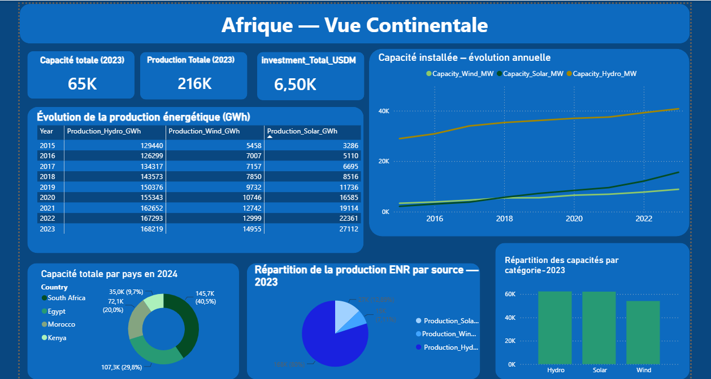
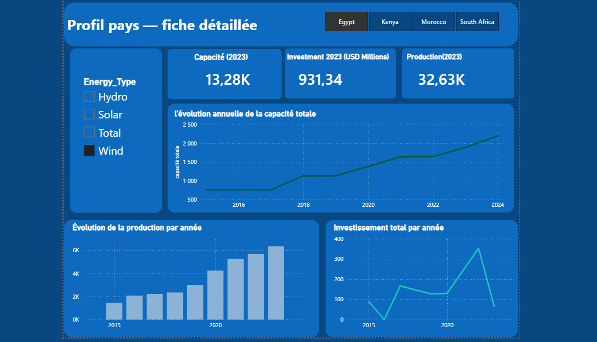
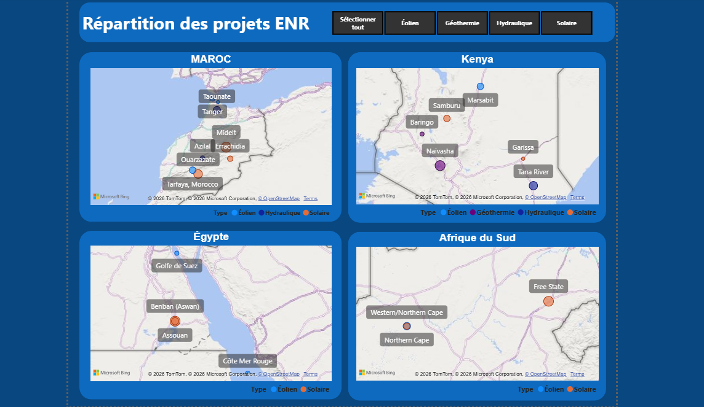

# Projet de Veille Technologique et Visualisation avec Power BI
### Veille Stratégique – Transition Énergétique en Afrique | Avril 2026

## Objectif

Mettre en place un processus de veille technologique afin de collecter des informations pertinentes sur les technologies étudiées, les organiser et les présenter sous forme de tableaux de bord interactifs dans Power BI.

Démarche suivie :
1. **Collecte des données**
2. **Préparation des données** (nettoyage, fusion, modélisation)
3. **Création des visualisations** interactives

Périmètre : Maroc, Kenya, Égypte, Afrique du Sud — période 2015-2024.

## Technologies utilisées

- **Power BI Desktop** – modélisation et dashboards
- **Power Query** – nettoyage et fusion des sources
- **DAX** – mesures et indicateurs

## Contenu du repo

```
veille_project/
├── powerbi/
│   └── Dashboard.pbix
├── screenshots/
│   ├── Afrique.png
│   ├── profil_pays.png
│   └── Projets_enr.png
└── README.md
```

> Note : aucun dataset brut n'est versionné dans ce repo. Les données sont intégrées directement dans le `.pbix`. Sources décrites ci-dessous.

## Phases du projet

### Phase 1 : Collecte des données
Sources : Flux RSS, Google Alerts, Google Scholar, IRENA, Banque Mondiale.

### Phase 2 : Préparation des données
Nettoyage et organisation avec Power Query.

### Phase 3 : Études de cas
Maroc, Kenya, Égypte, Afrique du Sud : projets majeurs, veille réglementaire, veille technologique.

### Phase 4 : Modèle Power BI
Fichier Excel source structuré en 4 volets :
- `Africa` – vue continentale
- `Capacite installee MW`
- `Production GWh`
- `Investissement USD M`

## Aperçu du tableau de bord

### Dashboard 1 : Vue continentale — Afrique


### Dashboard 2 : Profil détaillé par pays


### Dashboard 3 : Répartition des projets ENR


Ouvrir le rapport : `powerbi/Dashboard.pbix` avec Power BI Desktop.

## Résultats

- **Comparaison capacités ENR 2015-2024** par pays et technologie
- **Politiques d'investissement et financements internationaux**
- **Technologies émergentes :** stockage, smart grids, hydrogène vert
- **Positionnement du Maroc vs 3 autres pays**
  - Maroc — Le stratège patient
  - Égypte — L'ambitieux sous contrainte
  - Afrique du Sud — Le champion sous pression
  - Kenya — Le diversifié sous-financé
- **Veille stratégique Maroc :** opportunités, risques et contraintes, tendances à surveiller

## Bibliographie et sources

- IRENA – Renewable Capacity Statistics
- Banque Mondiale – API indicateurs développement
- Veille RSS / Google Alerts / Google Scholar (avril 2026)

